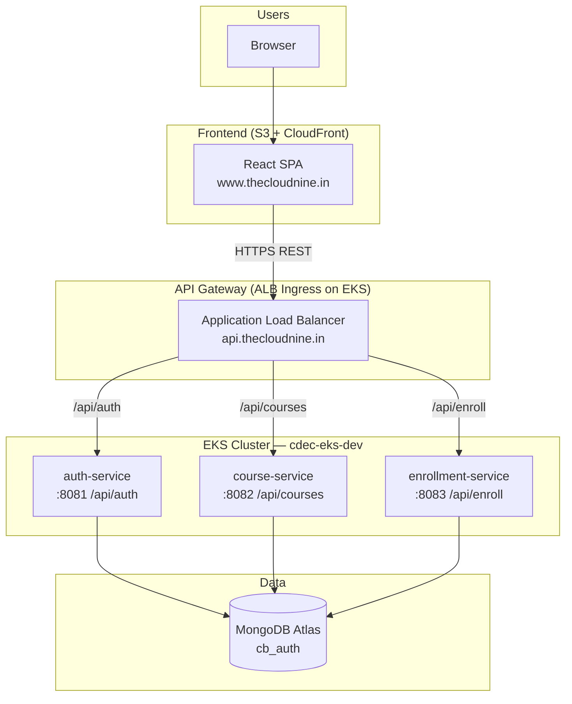
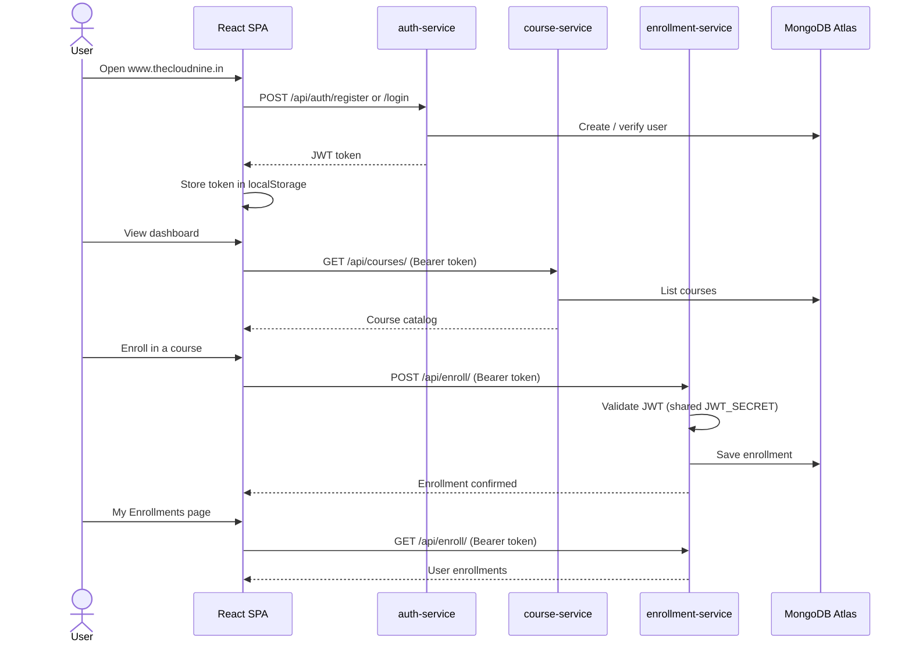
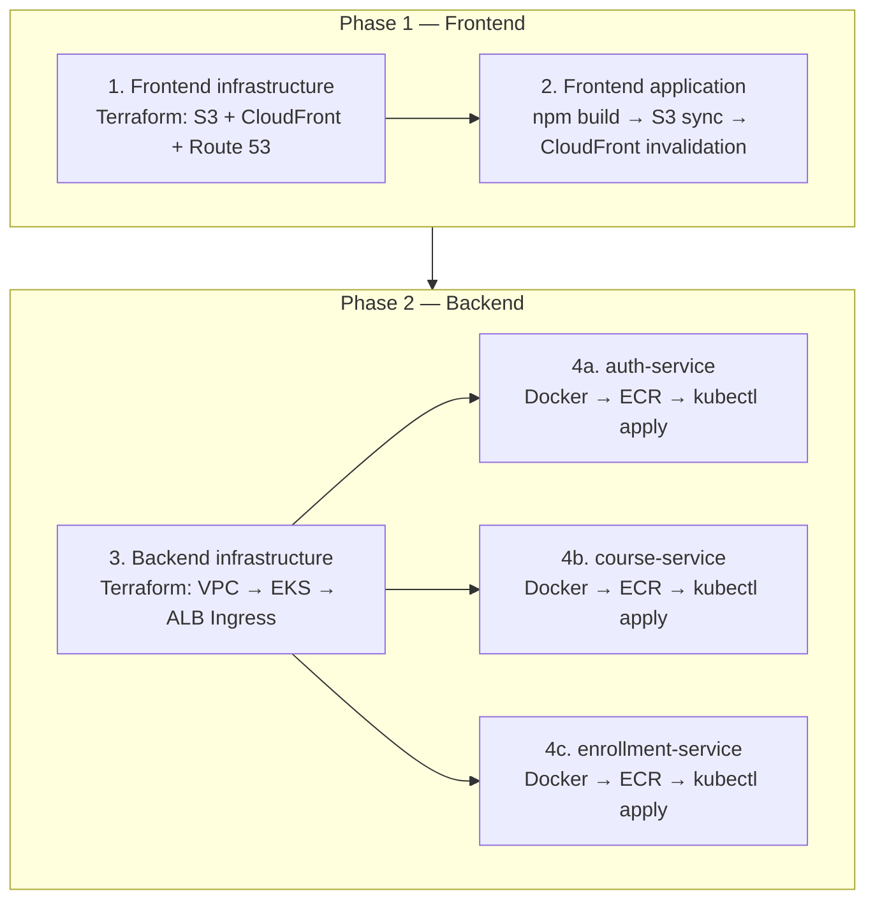

# CDEC Alpha — CloudBlitz Learning Platform

Course enrollment platform built as a React SPA with three Spring Boot microservices on AWS.

| Layer | Technology |
|-------|------------|
| Frontend | React 19, TypeScript, Vite, Tailwind CSS |
| Backend | Java 17, Spring Boot 3.2, MongoDB Atlas |
| Frontend hosting | S3 + CloudFront + Route 53 |
| Backend hosting | EKS, ALB Ingress, ECR |

## Environments (dev)

| Resource | Value |
|----------|-------|
| AWS account | `933516006319` |
| Region | `eu-west-1` |
| Frontend URL | `https://www.thecloudnine.in` |
| API URL | `https://api.thecloudnine.in` |
| EKS cluster | `cdec-eks-dev` |
| Terraform state bucket | `cdec-alpha-terraform-state-atulyw` |

---

## Application architecture



### Request flow (user journey)



### API routing (ALB Ingress)

| Path prefix | Service | Port |
|-------------|---------|------|
| `/api/auth` | auth-service | 8081 |
| `/api/courses` | course-service | 8082 |
| `/api/enroll` | enrollment-service | 8083 |

Frontend build-time API URLs (baked into the SPA):

| Variable | Production value |
|----------|------------------|
| `VITE_AUTH_API` | `https://api.thecloudnine.in/api/auth` |
| `VITE_COURSE_API` | `https://api.thecloudnine.in/api/courses` |
| `VITE_ENROLL_API` | `https://api.thecloudnine.in/api/enroll` |

---

## First-time deployment order

Deploy in two phases. **Frontend first**, then **backend**. The UI can be live before APIs exist; API URLs are configured at build time.



---

## Phase 1 — Frontend infrastructure and application

### Step 1: Frontend infrastructure

**Directory:** `infrastructure/frontend/`  
**Jenkins:** `infrastructure/frontend/Jenkinsfile`  
**Credential:** `aws-frontend-terraform`

Provisions:

- S3 bucket for static assets
- CloudFront distribution (ACM cert in `us-east-1`)
- Route 53 hosted zone / DNS alias for `www.thecloudnine.in`

```bash
cd infrastructure/frontend
cp backend.hcl.example backend.hcl      # if not already configured
cp terraform.tfvars.example terraform.tfvars
terraform init -backend-config=backend.hcl
terraform plan -var-file=terraform.tfvars
terraform apply -var-file=terraform.tfvars
```

After apply, delegate your domain at the registrar using the `route53_name_servers` output.

**Key `terraform.tfvars` values:**

```hcl
dns_zone_name   = "thecloudnine.in"
dns_record_name = "www.thecloudnine.in"
```

### Step 2: Frontend application

**Directory:** `application/frontend/`  
**Jenkins:** `application/frontend/Jenkinsfile`  
**Credential:** `aws-frontend-terraform`

```bash
cd application/frontend
npm ci

export VITE_AUTH_API=https://api.thecloudnine.in/api/auth
export VITE_COURSE_API=https://api.thecloudnine.in/api/courses
export VITE_ENROLL_API=https://api.thecloudnine.in/api/enroll
npm run build

BUCKET=$(terraform -chdir=../../infrastructure/frontend output -raw s3_bucket_name)
DIST_ID=$(terraform -chdir=../../infrastructure/frontend output -raw cloudfront_distribution_id)

aws s3 sync dist/ "s3://${BUCKET}/" --delete
aws cloudfront create-invalidation --distribution-id "$DIST_ID" --paths "/*"
```

---

## Phase 2 — Backend infrastructure and services

### Step 3: Backend infrastructure

**Directory:** `infrastructure/backend/`  
**Jenkins:** `infrastructure/backend/Jenkinsfile` (parameter `ACTION=create`)  
**Credential:** `aws-frontend-terraform`

Provisions (in order):

1. **VPC** — public/private subnets, NAT gateway, tags for EKS
2. **EKS** — control plane, managed node group, IAM access entries
3. **ALB Ingress** — AWS Load Balancer Controller (Helm), Kubernetes Ingress, HTTPS listener

```bash
cd infrastructure/backend
cp backend.hcl.example backend.hcl
cp terraform.tfvars.example terraform.tfvars
terraform init -backend-config=backend.hcl
terraform plan -var-file=terraform.tfvars
terraform apply -var-file=terraform.tfvars
```

**Key `terraform.tfvars` values:**

```hcl
cluster_name       = "cdec-eks-dev"
kubernetes_version = "1.34"
enable_alb_ingress = true
ingress_host       = "api.thecloudnine.in"
include_caller_as_cluster_admin = true   # grants Jenkins/Terraform user kubectl access
```

> **Prerequisite:** Create ECR repositories and an ACM certificate for `api.thecloudnine.in` in `eu-west-1` before deploying services.

### Step 4: Backend services

Each service follows the same pattern: **build Docker image → push to ECR → `kubectl apply`**.

| Service | Port | Jenkinsfile | K8s manifest |
|---------|------|-------------|--------------|
| auth-service | 8081 | `application/backend/auth-service/Jenkinsfile` | `k8s/deployment.yml` |
| course-service | 8082 | `application/backend/course-service/Jenkinsfile` | `k8s/deployment.yml` |
| enrollment-service | 8083 | GitHub Actions (`.github/workflows/enrollment-service.yml`) | `k8s/deployment.yml` |

**ECR image registry:**

```text
933516006319.dkr.ecr.eu-west-1.amazonaws.com/backend/<service-name>:latest
```

**Manual deploy example (auth-service):**

```bash
cd application/backend/auth-service

docker build -t 933516006319.dkr.ecr.eu-west-1.amazonaws.com/backend/auth-service:latest .

aws ecr get-login-password --region eu-west-1 | \
  docker login --username AWS --password-stdin 933516006319.dkr.ecr.eu-west-1.amazonaws.com
docker push 933516006319.dkr.ecr.eu-west-1.amazonaws.com/backend/auth-service:latest

aws eks update-kubeconfig --region eu-west-1 --name cdec-eks-dev
kubectl apply -f k8s/deployment.yml -n default
kubectl rollout status deployment/auth-service -n default --timeout=300s
```

Repeat for `course-service` and `enrollment-service`.

**Shared runtime config:**

| Variable | Used by |
|----------|---------|
| `MONGO_URI` | All services |
| `JWT_SECRET` | auth-service, enrollment-service (must match) |

---

## Jenkins pipelines summary

| Order | Pipeline | Script path | Agent label |
|-------|----------|-------------|-------------|
| 1 | Frontend infra | `infrastructure/frontend/Jenkinsfile` | `terraform` |
| 2 | Frontend app | `application/frontend/Jenkinsfile` | `terraform` |
| 3 | Backend infra | `infrastructure/backend/Jenkinsfile` | `terraform` |
| 4 | auth-service | `application/backend/auth-service/Jenkinsfile` | `terraform` + `master` (Docker) |
| 5 | course-service | `application/backend/course-service/Jenkinsfile` | `terraform` + `master` (Docker) |

Jenkins agent requirements:

- **Terraform jobs:** Terraform CLI, `terraform.tfvars` and `backend.hcl` on the agent
- **Frontend app:** Node.js 20, npm, AWS CLI
- **Backend services:** Docker, AWS CLI, kubectl

---

## Repository layout

```text
cdec-alpha-app/
├── README.md                          # This file
├── application/
│   ├── frontend/                      # React SPA
│   └── backend/
│       ├── auth-service/              # JWT auth, user registration
│       ├── course-service/            # Course catalog CRUD
│       └── enrollment-service/        # Course enrollments
└── infrastructure/
    ├── frontend/                      # S3 + CloudFront + Route 53
    ├── backend/                       # VPC + EKS + ALB Ingress
    └── modules/                       # Shared Terraform modules
        ├── vpc/
        ├── eks/
        ├── cloudfront/
        ├── route53/
        └── alb-ingress/
```

---

## Verification checklist

After a full deploy:

```bash
# Frontend
curl -I https://www.thecloudnine.in

# API health endpoints
curl https://api.thecloudnine.in/api/auth/health
curl https://api.thecloudnine.in/api/courses/health
curl https://api.thecloudnine.in/api/enroll/health

# EKS workloads
aws eks update-kubeconfig --region eu-west-1 --name cdec-eks-dev
kubectl get pods,svc,ingress -n default
```

---

## Further reading

| Topic | Location |
|-------|----------|
| Frontend app | [application/frontend/README.md](application/frontend/README.md) |
| Backend services | [application/backend/README.md](application/backend/README.md) |
| Frontend Terraform | [infrastructure/frontend/README.md](infrastructure/frontend/README.md) |
| Backend Terraform / kubectl access | [infrastructure/backend/README.md](infrastructure/backend/README.md) |
| Per-service deploy | `application/backend/*/README.md` |
